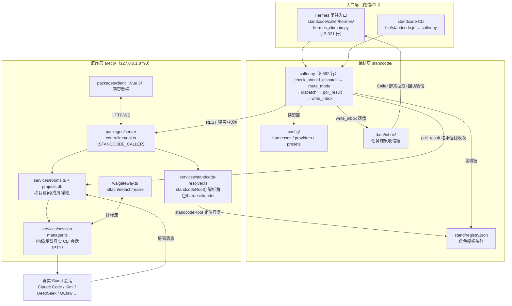
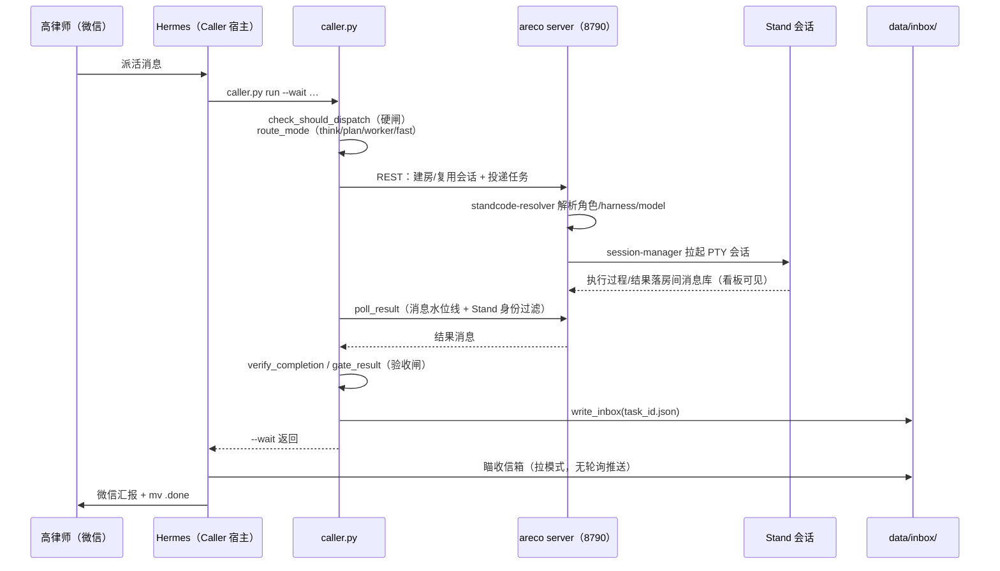

# StandCode × areco 架构图（2026-07-31，基于总仓 CodeGraph 索引）

> 依据：`/Users/gao/Code/StandCode/.codegraph`（357 文件 / 10,526 节点 / 33,193 边）实测符号绘制。
> 图中每个节点都能在索引里查到（符号名见 `codegraph-cheatsheet.md` 第 3 节）。
> Mermaid 源码，GitHub/VSCode/Obsidian 直接渲染。

## 1. 全景：三层 + 底座

## 2. 一次派单的时序（主链路）

## 3. 跨层接线（总仓索引实测，搬仓后仍有效）

| 接线点 | 符号 | 位置 |
|---|---|---|
| areco 定位 standcode 真身 | `standcodeRoot()` | areco/packages/server/src/services/standcode-resolver.ts:9 |
| 角色注册表路径 | `STAND_REGISTRY_PATH` | 同文件 :267 → standcode/stand/registry.json |
| 配置目录 | `STANDCODE_CONFIG_DIR` | 同文件 → standcode/config/ |
| areco 侧 Caller 路径 | `STANDCODE_CALLER` | areco/packages/server/src/controllers/api.ts → standcode/caller/caller.py |
| 会话承载 | `SessionManager` | areco/packages/server/src/services/session-manager.ts |
| 房间↔会话中继 | `room-relay.ts` | areco/packages/server/src/services/room-relay.ts:14 |
| 终端 WS 网关 | `attach/detach/resize` | areco/packages/server/src/ws/gateway.ts:232/298 |

## 4. 规模与语言（2026-07-31 索引实测）

| 层 | 索引 | 文件 | 节点 | 边 |
|---|---|---:|---:|---:|
| 编排层 | standcode/.codegraph | 230 | 7,627 | 23,778 |
| 总仓 | .codegraph | 357 | 10,526 | 33,193 |

总仓语言分布：Python 226 / TypeScript 90 / Vue 27 / JavaScript 11 / YAML 3。

## 5. 边界声明

本图是 CodeGraph 本地确定性索引的**结构化视图**（符号、调用、配置链均实测可查），
不是 LLM 生成的交互式图形看板。Understand-Anything / Graphify 看板未运行（成本待高律师确认）。
